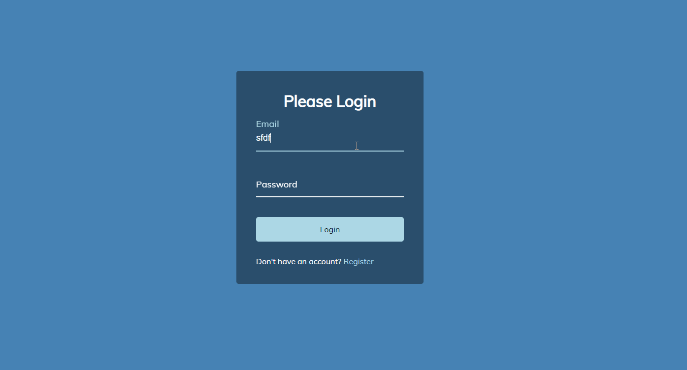

# Input Form Wave Animation 

## 🦉 Main information

Simple login form with a wave effect on the labels.

The project goal:
- when a user clicks in the input, he can see the label wave up
- to do this effect, wrap a span around each letter of label using Vanilla JavaScript
- add a transition that the label moves up when an user focus on the input
- add a dynamic transition delay to gives it the wave effect
- set up in HTML, style it with CSS and add the functionality with JavaScript

## ⚡ Built With
[HTML5](https://www.w3schools.com/html/) / [CSS3](https://www.w3schools.com/css/) / [JavaScript](https://www.w3schools.com/js/)